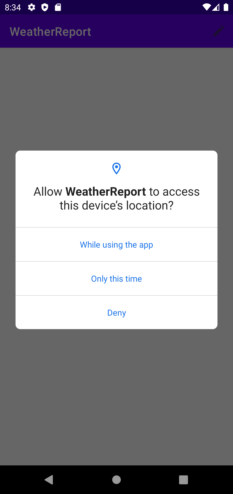
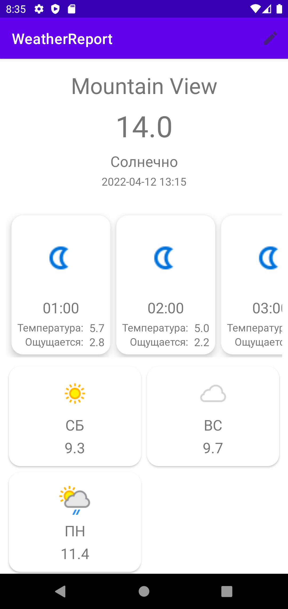
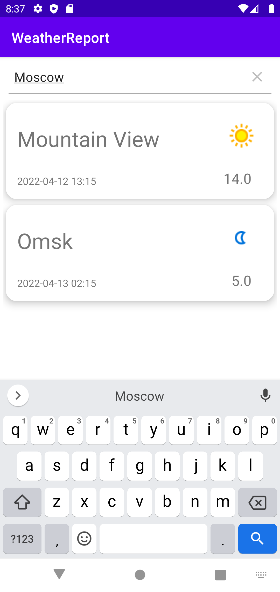
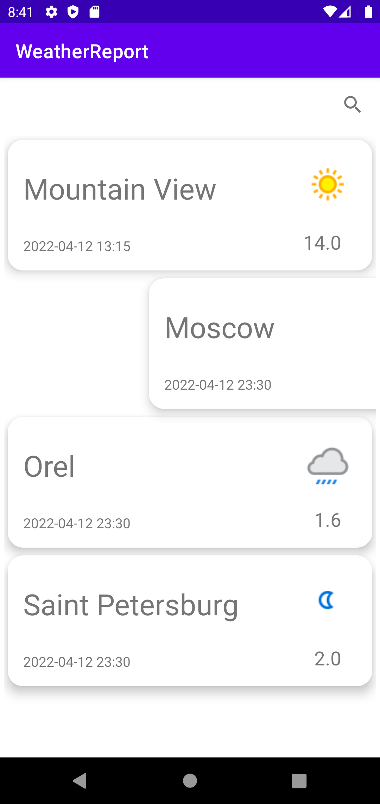
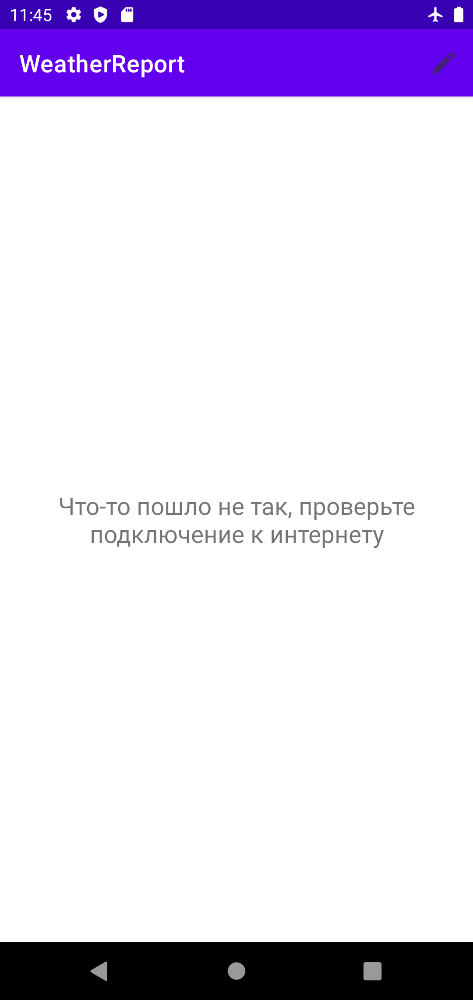
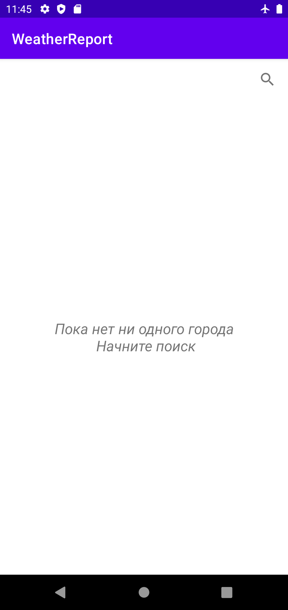

# Прогноз погоды

Тестовое задание для отбора на стажировку в Avito по направлению Android. Приложение для просмотра пгроноза погоды, обладающее следющим функционалом:

- [x] Отображание прогноза за текущий день
- [x] Отображение прогноза погоды за неделю [(1)](#anchor_one)
- [x] Просмотр прогноза погоды в текущем городе
- [x] Возможность выбирать любой другой город и смотреть прогноз погоды в нем

## Описание
***

- При запуске приложения пользователь увидит окно, в котором он сможет разрешить получать доступ к своему местоположению. Если пользователь согласится, то при наличии доступа к интернету на экране появится прогноз погоды по текущему местоположению. [(2)](#anchor_one)

 | 

- Для получения прогноза в другом городе можно перейти на экран с поиском, нажав на кнопку в меню сверху. Здесь же будут также отображаться ранее запрашиваемые местоположения. В случае необходимости их можно удалить, "свайпнув" вправо элемент списка.

 | 

- В случае отсуствия интернет-соединения при попытке запроса прогноза погоды в новом городе пользователю высветится сообщение об ошибке.

- Если у пользователя не было ни одного сохраненного города ранее (например, он запустил приложение впервые, а интернет-соединение отсутствует), то при переаходе на экран поиска он увидит сообщение об отсутсвии сохраненных прогнозов погоды

## TODO
***

- Поддержка темной темы и работа со стилями
- Больше тестов

## Замечания
***

- (1) В качестве API было выбрано <a href="https://www.weatherapi.com/">WeatherApi.com</a>, однако бесплатная его версия позволяет получать прогноз только на 3 дня, однако если приобрести платную версию API и вставить соответствующий API_KEY, то приложение автоматически будет показывать прогноз на неделю

- (2) При повторном запуске приложения пользователь будет видеть прогноз по той локации, которая последняя отображалась на главном экране приложения. Если же последняя локация отсутсвует по той или иной причине, то при подключении к интернету пользователь сможет узнать погоду в столице России. 
